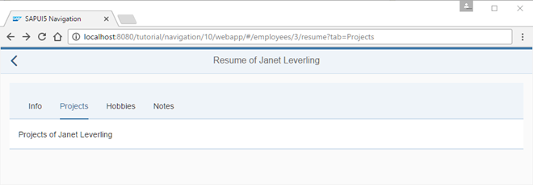

# Implement Lazy Loading

Trong các bước trước, chúng ta đã triển khai một view `Resume` sử dụng các tab để hiển thị dữ liệu. Toàn bộ nội dung của các tab được tải một lần, bất kể tab nào đang được hiển thị. Chúng ta có thể tăng hiệu suất của ứng dụng bằng cách tránh tải nội dung không nhìn thấy. Do đó, chúng ta sẽ triển khai tính năng `lazy loading` để chỉ tải view và dữ liệu khi người dùng yêu cầu.

Để minh họa tính năng `lazy loading`, chúng ta triển khai việc chỉ tải nội dung khi người dùng chọn tab tương ứng đối với hai tab trong `IconTabBar` của chúng ta: `Hobbies` và `Notes`. Các điều khiển `IconTabFilter` của mỗi tab đều có ID cố định để chúng ta có thể tham chiếu đến sau trong cấu hình định tuyến. Trong các trường hợp sử dụng thực tế, bạn sẽ làm điều này cho những tab chứa nhiều nội dung hoặc kích hoạt các cuộc gọi dịch vụ tốn kém tới dịch vụ back-end.

Trong `resume view`, chúng ta loại bỏ nội dung của các tab `Hobbies` và `Notes` vì chúng ta sẽ điền nội dung vào một cách động khi có tính năng điều hướng.

Tạo file `ResumeHobbies.view.xml` trong thư mục `webapp/view/employee`. Chuyển nội dung của tab đã có trước đó trong `resume view` sang file này. Chúng ta không cần một controller cho view này vì không có logic bổ sung nào liên quan. View này sẽ được lazy-loaded và đặt vào nội dung của tab `Hobbies` với các tính năng điều hướng.

Mở rộng controller của resume và thêm logic bổ sung vào hàm `_onRouteMatched` nơi một tab mới đã được chọn và xác thực. Trong trường hợp `selectedKey` khớp với `Hobbies` hoặc `Notes`, chúng ta sẽ gọi `this.getRouter().getTargets().display("resumeTab" + oQuery.tab)` để hiển thị target tương ứng một cách thủ công. Ở đây, các target hợp lệ là `resumeTabHobbies` và `resumeTabNotes` vì chúng ta đã thay đổi hành vi cho hai tab này bằng cách tạo các views riêng biệt.

Những dòng mã này đảm bảo rằng các target chỉ được tải khi chúng cần thiết (lazy loading). Tuy nhiên, router vẫn chưa biết về các target mới này, vì vậy chúng ta cần tạo chúng trong cấu hình routing của mình.

Chúng ta thêm các mục tiêu `resumeTabHobbies` và `resumeTabNotes` vào tệp mô tả (descriptor file) với các trường bổ sung để ghi đè cấu hình mặc định, vì bây giờ chúng ta muốn hiển thị các mục tiêu này nội bộ trong điều khiển `IconTabBar` thay vì là các trang của ứng dụng.

Mục tiêu `resumeTabHobbies` thiết lập thuộc tính `parent` thành `employeeResume`. Thuộc tính parent mong đợi tên của một mục tiêu khác. Trong trường hợp của chúng ta, điều này đảm bảo rằng view từ mục tiêu cha `employeeResume` được tải trước khi mục tiêu `resumeTabHobbies` được hiển thị. Điều này có thể được coi là một sự phụ thuộc giữa các view. Bằng cách thiết lập các thuộc tính `controlId` và `controlAggregation`, router sẽ đặt view `ResumeHobbies` vào trong aggregation content của điều khiển `IconTabFilter` có ID `hobbiesTab`. Chúng ta cũng thiết lập một tham số id với một ID tùy chỉnh để minh họa cách bạn có thể ghi đè một ID cố định bên trong view.

Bây giờ, chúng ta thêm mục tiêu `resumeTabNotes` tương tự như mục tiêu `resumeTabHobbies`. Mục tiêu `resumeTabNotes` cũng định nghĩa mục tiêu cha là `employeeResume`, vì chúng chia sẻ cùng một view cha. Chúng ta sẽ đặt view `ResumeNotes` vào aggregation content của điều khiển `IconTabFilter` có ID là `notesTab`.

Chúng ta đã triển khai việc tải lười (lazy loading) cho các tab `Hobbies` và `Notes`. Hai tab này giờ đây được quản lý bởi cấu hình routing và chỉ được tải khi người dùng nhấp vào chúng lần đầu tiên.

Hãy thử nghiệm: Mở tab Network trong công cụ phát triển của trình duyệt và nhấp vào các tab trong ứng dụng của bạn. Trong lưu lượng mạng (network traffic), bạn sẽ thấy rằng tệp `ResumeHobbies.view.xml` chỉ được tải khi tab Hobbies được hiển thị lần đầu tiên. Điều tương tự cũng áp dụng cho tab Notes. Nhiệm vụ đã hoàn thành!
