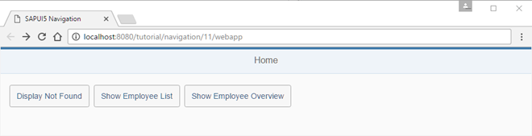
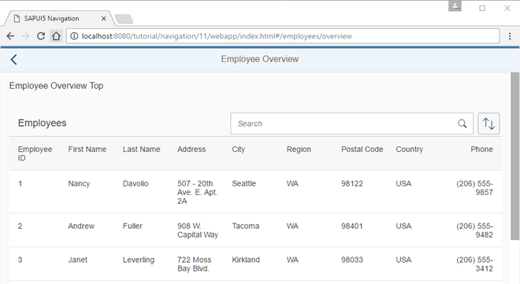
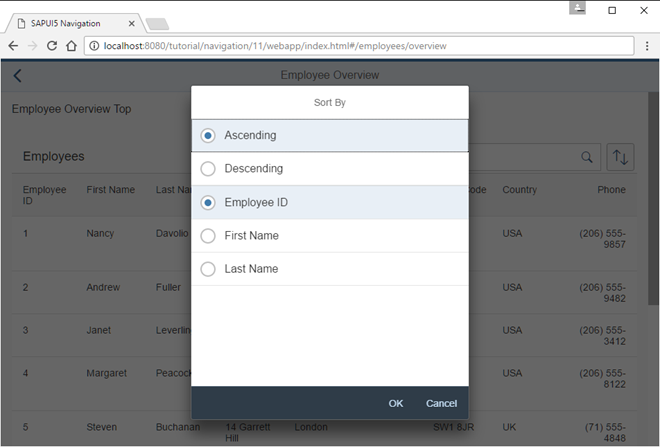

# Assign Multiple Targets

Chúng ta sẽ thêm một button mới vào Home để minh họa cách sử dụng nhiều `targets` cho một route. Khi button được nhấn, một page mới sẽ mở ra bao gồm hai phần: top and a content part. Phần nội dung hiển thị một bảng nhân viên có thể được sắp xếp và tìm kiếm. Chúng ta sẽ sử dụng cú pháp mảng trong cấu hình routing để gán nhiều targets cho một route - đây là một tính năng mà chúng ta chưa giới thiệu trước đó

New button Show Employee Overview

Employee Overview with search field

Sort options for the Employee Overview

Bây giờ, chúng ta sẽ mở rộng controller của trang hồ sơ một chút và thêm logic bổ sung vào phần hàm `_onRouteMatched` nơi một tab mới đã được chọn và xác thực. Trong trường hợp `selectedKey` khớp với `Hobbies` hoặc `Notes`, chúng ta sẽ gọi `this.getRouter().getTargets().display("resumeTab" + oQuery.tab)` để hiển thị `target` tương ứng một cách thủ công. Ở đây, các `target` hợp lệ là `resumeTabHobbies` và `resumeTabNotes` vì chúng ta đã thay đổi hành vi cho hai tab này bằng cách tạo các views riêng biệt.

Bây giờ chúng ta tạo cả hai targets: `employeeOverviewTop` và `employeeOverviewContent`, cũng như parent target là `employeeOverview`. Trên parent target, chúng ta thiết lập thuộc tính level là 2 để đảm bảo hiệu ứng chuyển đổi hoạt động chính xác. Trong các targets, chúng ta cũng cấu hình nơi các views tương ứng của các child targets sẽ được hiển thị bằng cách thiết lập các tham số controlId và `controlAggregation` tới một ID của control `sap.ui.layout.HorizontalLayout` mà chúng ta sắp tạo trong một view mới. Bạn nên quen thuộc với cấu hình này từ bước trước.

Router sẽ đảm bảo rằng view của `parent target` được tải thêm cùng với `view` của `target` khi một route tương ứng được khớp và các targets được hiển thị. Các `views` được tham chiếu sẽ tự động hiển thị tại vị trí đã cấu hình trong view của `parent target`, trong trường hợp này là trong thuộc tính `content aggregation` của control `page`. Chúng ta đã đề cập đến ba `views` khác nhau mà chúng ta vẫn cần thêm vào ứng dụng để cấu hình hoạt động:

Cuối cùng, hãy tạo controller cho trang `Employee Overview` trong thư mục `webapp/controller/employee/overview`. Controller này về cơ bản sẽ thiết lập một `ViewSettingsDialog` để sắp xếp và lọc bảng dữ liệu của các nhân viên, đồng thời triển khai các event handlers cho search field và chức năng sắp xếp bảng.

Không có gì đặc biệt trong phần triển khai này. Nếu bạn quan tâm đến cách thiết lập một bảng với chức năng sắp xếp và lọc, bạn có thể tham khảo các bước tương ứng trong Walkthrough tutorial hoặc các ví dụ trong Demo Kit. Chúng tôi chủ yếu sử dụng giao diện người dùng (UI) và các tính năng để hiển thị điều hướng bổ sung cũng như các tính năng định tuyến. Do đó, chúng tôi gợi ý bạn sao chép đoạn mã và thử nghiệm.

Mở `webapp/index.html#/employees/overview` và kiểm tra các views mới. Như bạn thấy, ba views được liên kết tự động bởi router dựa trên cấu hình của chúng ta trong descriptor. Ở phần trên của trang, bạn sẽ thấy một dòng văn bản tĩnh, và bên dưới là bảng được điền dữ liệu từ dịch vụ kiểm tra của chúng ta. Toàn bộ chức năng định tuyến mà chúng ta thấy trong ví dụ này được triển khai bằng cách tham chiếu hai targets từ một route.

Dĩ nhiên, bạn cũng có thể tìm kiếm trong bảng và thay đổi cách sắp xếp. Khi hộp thoại sắp xếp mở ra, nó tạo ra một lớp chặn (block layer) để nút quay lại (back button) và các controls khác không thể truy cập được. Tuy nhiên, bạn vẫn có thể sử dụng nút quay lại của trình duyệt. Như bạn thấy, hộp thoại được đóng tự động bởi router trước khi thực hiện điều hướng.
