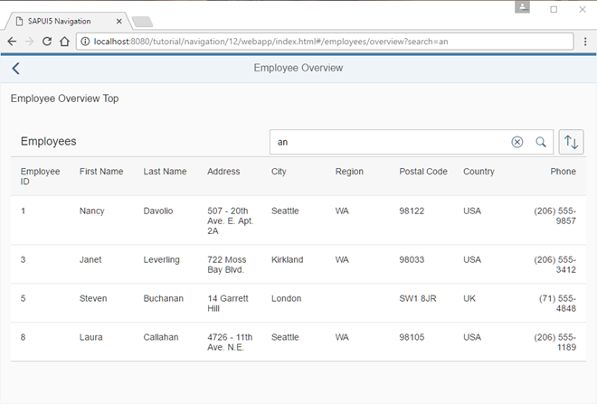

# Make a Search Bookmarkable

Chúng ta sẽ làm cho chức năng search có thêm (bookmarkable) . Điều này cho phép người dùng tìm kiếm employees trong bảng `Employees`, sau đó có thể đánh dấu (bookmark) truy vấn tìm kiếm của họ hoặc chia sẻ URL.

Chúng ta quyết định cho phép URL dạng `/#/employees/overview?search=mySearchQueryString` để đánh dấu một tìm kiếm. Do đó, chúng ta chỉ cần mở rộng cấu hình định tuyến của mình một chút. Chúng ta thêm tham số tùy chọn `:?query:` vào route `employeeOverview`.

Khi làm điều này, chúng ta cần nhớ rằng tham số URL cho từ khóa tìm kiếm (search term) được nhập vào trường tìm kiếm sẽ sử dụng khóa `search`.

Để làm cho chức năng tìm kiếm có thể đánh dấu (bookmarkable), chúng ta cần suy nghĩ về cách mẫu (pattern) của route tương ứng sẽ khớp với dấu trang (bookmark). Chúng ta quyết định cho phép dạng URL `/#/employees/overview?search=mySearchQueryString` để đánh dấu một truy vấn tìm kiếm. Do đó, chúng ta chỉ cần mở rộng cấu hình routing một chút.

Chúng ta thêm tham số tùy chọn `:?query:` vào route `employeeOverview`. Lưu ý rằng chúng ta sẽ sử dụng `search` làm tham số URL để chứa từ khóa tìm kiếm mà người dùng nhập vào trường tìm kiếm.

Bây giờ chúng ta sẽ xử lý tham số query tùy chọn từ route `employeeOverview` trong controller `EmployeeOverviewContent`. Đầu tiên, chúng ta thay đổi hàm `onInit` bằng cách thêm một listener sự kiện cho sự kiện matched của route `employeeOverview`. Sau đó, chúng ta lưu trữ các tham số router hiện tại từ sự kiện nhận được. Nếu một query tồn tại, kết quả từ `oEvent.getParameter("arguments")` sẽ chứa thuộc tính `?query` với một đối tượng bao gồm tất cả các tham số URL được chỉ định, nếu không thì giá trị sẽ là undefined. Nếu không có tham số query nào được định nghĩa, chúng ta luôn khởi tạo query và lưu nó vào `this._oRouterArgs["?query"]`.

Nếu có từ khóa tìm kiếm ở khóa search, chúng ta tiếp tục và gọi `this._applySearchFilter(this._oRouterArgs["?query"].search)` để kích hoạt tìm kiếm dựa trên tham số query từ URL.

Việc lưu trữ các đối tượng tham số nội bộ trong controller là rất quan trọng vì chúng ta sẽ sử dụng các tham số hiện tại khi gọi `navTo()` trong trình xử lý sự kiện tìm kiếm `onSearchEmployeesTable`. Chúng ta chuyển tiếp các tham số với từ khóa tìm kiếm được cập nhật. Chúng ta đồng bộ hóa URL và giao diện người dùng (UI) bằng cách điều hướng lại tới mục tiêu hiện tại với giá trị hiện tại của trường tìm kiếm từ nguồn của sự kiện. Giá trị tìm kiếm được lưu trữ trong `this._oRouterArgs["?query"].search` cùng với các tham số query khác và được chuyển trực tiếp trở lại router.s
