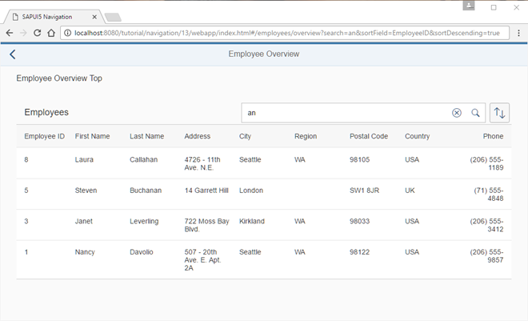

# Make Table Sorting Bookmarkable

Hiển thị trạng sắp xếp trên URL

**Bookmarkable search and sorting**

Chúng ta cải tiến controller `EmployeeOverviewContent` thêm để hỗ trợ việc bookmark các tùy chọn sắp xếp của bảng. Chúng ta sẽ nhận hai tham số truy vấn `sortField` và `sortDescending` từ URL để cấu hình việc sắp xếp bảng. Trong handler của route `employeeOverview`, chúng ta lưu tham số truy vấn vào biến `oQueryParameter` và gọi thêm một lệnh gọi `this._applySorter(oQueryParameter.sortField, oQueryParameter.sortDescending)`. Điều này kích hoạt hành động sắp xếp dựa trên hai tham số truy vấn `sortField` và `sortDescending` từ URL.

Tiếp theo, chúng ta thay đổi các handler sự kiện confirm của `ViewSettingsDialog`. Handler confirm cập nhật các tham số router hiện tại với các tham số từ sự kiện tương ứng. Sau đó, chúng ta gọi `oRouter.navTo("employeeOverview", this._oRouterArgs, true)` với các tham số router đã được cập nhật để lưu trữ các tham số sắp xếp mới vào URL. Cả hai tham số trước (ví dụ: tìm kiếm) và các tham số mới cho việc sắp xếp sẽ được xử lý bởi handler sự kiện matched của route `employeeOverview`.
