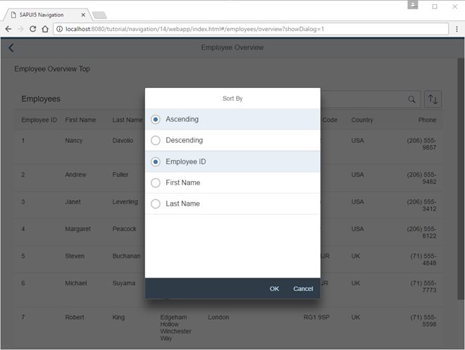

# Make Dialogs Bookmarkable

Employees display .



update EmployeeOverviewContent controller để add hỗ trợ bookmarking sorting dialog.Query parameter `showDialog` để kiểm soát dialog có được mở trực tiếp hay không khi chúng tôi navigate đến liên kết sau.Nếu query parameter `showDialog` được 1, sẽ open dialog

khi nhất vào sort button. Function onSortButtonPressed, chúng ta set `this._oRouterArgs["?query"].showDialog = 1` và call navTo() để cho route thực hiện cv thay vì trực tiếp mở dialog. Xoá `this._oRouterArgs["?query"].showDialog` trước khi gọi navTo() và cancel event handle ở `ViewSettingsDialog`

We are now done with this step. Try to access the following pages:

```js
webapp/index.html#/employees/overview?showDialog=1

webapp/index.html#/employees/overview?search=an&sortField=EmployeeID&sortDescending=true&showDialog=1
```
