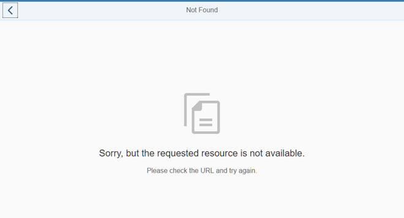

# Add a Back Button to Not Found Page

Khi ở trang `Not Found` do hash không hợp lệ.Vì vậy, chúng ta sẽ thêm một nút `Back` vào view `NotFound` và đảm bảo rằng khi nhấn nút này, người dùng sẽ được chuyển hướng đến trang trước đó hoặc trang tổng quan (`overview page`).

Trong view `NotFound`, chúng tôi đặt properties `showNavButton` của control `MessagePage` thành `true` để tự động hiển thị nút `Back`. Đồng thời, chúng ta thêm một hàm xử lý sự kiện `onNavBack` cho sự kiện navButtonPress của control. Hàm `onNavBack` sẽ xử lý việc điều hướng quay lại thực tế.

Thay vì thêm trực tiếp hàm này vào controller của view, chúng ta thông minh hơn khi dự đoán rằng hàm xử lý này có thể cần được sử dụng cho nhiều view khác nhau. Áp dụng nguyên tắc DRY (`Don’t Repeat Yourself`), chúng ta sẽ tạo một `BaseController`, từ đó tất cả các controller khác sẽ kế thừa.
