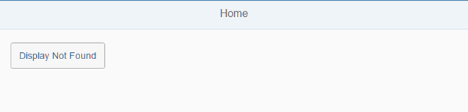

# Display a Target Without Changing the Hash

Hiển thị `Not Found target` từ bước mà không thay đổi hash để minh hoạ mẫu điều hướng này. Đồng thời, chúng ta cũng sẽ xem xét một tác dụng phụ ngăn cản việc quay lại trong trường hợp này.

May mắn thay, chúng ta có thể mở rộng ứng dụng và cung cấp một giải pháp đơn giản. Có một số trường hợp sử dụng không nên được lưu trữ trong URL mà chỉ được kích hoạt bởi logic ứng dụng khi cần thiết. Một target là một cấu hình liên quan đến điều hướng cho một view, và chúng ta có thể hiển thị các target thủ công mà không cần tham chiếu chúng trong một route điều hướng. Những ví dụ điển hình cho điều này là lỗi tạm thời, chuyển sang trang chỉnh sửa của một đối tượng kinh doanh, hoặc đi đến trang Cài đặt. Đôi khi, bạn cũng sẽ phải triển khai một cách để quay lại thủ công.

<Button id="employeeListBtn" text="{i18n>ShowEmployeeList}" press=".onNavToEmployees" class="sapUiTinyMarginEnd"/>
