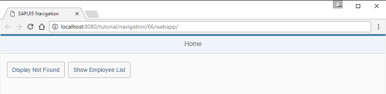
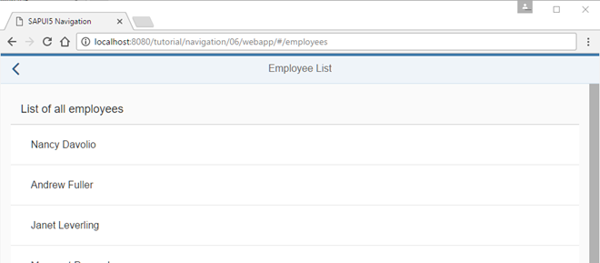

# Navigate to Routes with Hard-Coded Patterns

Trong bước này, chúng ta sẽ tạo button thứ hai trên Home để chúng ta có thể điều hướng đến một danh sách nhân viên đơn giản. Ví dụ này minh họa cách điều hướng đến một tuyến đường có mẫu được hard-coded.

