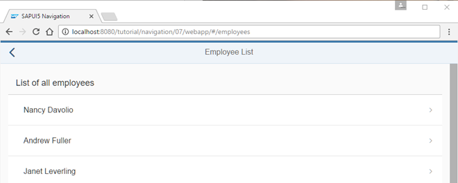

# Navigate to Routes with Mandatory Parameters

Cho phép người dùng nhấn vào 1 employees bất kì trong list để xem details.Route pattern có thế một hoặc nhiều parameter để xác định đối tượng

Từ model data `webapp/localService/metadata.xml` hoặc `webapp/localService/mockdata/Employees.json`. Mỗi 1 employees được xác định bằng `EmployeesID`. Định nghĩa chúng bằng tuyến đường (route) mới yêu cầu parameter `employeesId`, bắt buộc mẫu của nó phải tham chiếu đến 1 employees.Chung tạ một tuyến đường mới có tên là `employee` và sử dụng `employees/{employeesID}`

`{employees}` trong mẫu là parameter bắt buộc, được hiển thị bằng dấu ngoặc nhọn. Phần hash chứa 1 `employeeId` thực tế được đối với mẫi này tại 1 điểm chạy

Các hash sau đây sẽ khớp trong trường hợp của chúng ta: employees/2, employees/7, employees/anInvalidId, v.v. Tuy nhiên, hash employees/ sẽ không khớp vì nó không chứa bất kỳ ID nào cả. Target của tuyến đường này là employee. Chúng ta tạo target employee với cấp độ 3 (level 3). Điều này đảm bảo rằng hiệu ứng trượt (slide animation) sẽ hoạt động đúng hướng.

Tiếp theo, chúng ta cần tạo view `employees.Employee`; để minh họa rõ hơn, lần này đường dẫn (path) không được chỉ định.

Tạo tệp `Employee.view.xml` bên trong thư mục `webapp/view/employee`. View này hiển thị dữ liệu chính của một nhân viên trong một panel sử dụng điều khiển `SimpleForm`: bao gồm họ, tên, và các thông tin khác. Dữ liệu được lấy từ một ràng buộc dữ liệu tương đối được thiết lập ở cấp độ view, như sẽ thấy trong controller sau. Vì chúng ta đang tập trung vào các khía cạnh điều hướng trong hướng dẫn này, chúng ta sẽ không đi vào chi tiết các điều khiển của view.

Trong trình xử lý sự kiện, chúng ta có thể truy cập tham số arguments từ tham số oEvent, chứa tất cả các tham số từ mẫu (pattern). Vì listener này chỉ được gọi khi route được khớp, chúng ta có thể chắc chắn rằng tham số bắt buộc employeeId luôn có mặt dưới dạng một khóa trong arguments; nếu không, route sẽ không được khớp. Tên của tham số bắt buộc employeeId tương ứng với {employeeId} trong định nghĩa mẫu của route employee và do đó tương ứng với giá trị trong URL.

Trong `_onRouteMatched`, chúng ta gọi `bindElement()` trên view để đảm bảo rằng dữ liệu của employees được chỉ định có sẵn trong view và các điều khiển của nó. `ODataModel` sẽ xử lý các yêu cầu dữ liệu cần thiết tới backend ở chế độ nền. Trong khi dữ liệu đang tải, sẽ hữu ích nếu hiển thị một chỉ báo bận (busy indicator) bằng cách đơn giản đặt view vào trạng thái bận. Do đó, chúng ta truyền một đối tượng events vào `bindElement()` để lắng nghe các sự kiện `dataRequested` và `dataReceived`. Các hàm được gắn vào sẽ xử lý trạng thái bận bằng cách gọi `oView.setBusy(true)` và `oView.setBusy(false)` tương ứng.

Chúng ta cũng thêm một trình xử lý sự kiện cho sự kiện change dưới dạng một hàm riêng tư `_onBindingChange`. Hàm này kiểm tra xem dữ liệu có thể được tải hay không bằng cách truy vấn binding context của view. Như đã thấy ở các bước trước, chúng ta sẽ hiển thị target notFound nếu dữ liệu không thể được tải.

Đã đến lúc thay đổi view `EmployeeList` để chúng ta có thể điều hướng đến view mới. Chúng ta đặt thuộc tính `type` của mẫu `StandardListItem` thành `Navigation` để làm cho mục trong danh sách có thể nhấp và hiển thị tính năng điều hướng cho người dùng. Thêm vào đó, chúng ta sẽ thêm một trình xử lý sự kiện cho sự kiện `press`, sự kiện này sẽ được gọi khi người dùng nhấp vào một mục trong danh sách nhân viên.
