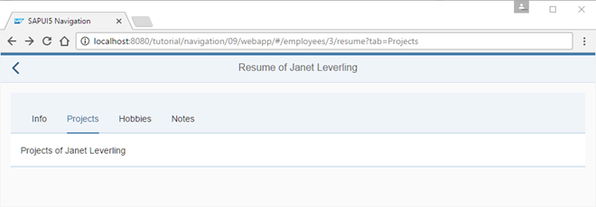

# Allow Bookmarkable Tabs with Optional Query Parameters

View hồ sơ (`resume view`) chứa bốn tab như chúng ta đã thấy trong các bước trước. Tuy nhiên, khi người dùng điều hướng đến trang hồ sơ, chỉ có tab đầu tiên được hiển thị ban đầu. Việc điều hướng trực tiếp đến một tab cụ thể hoặc đánh dấu (bookmark) một tab hiện tại chưa được hỗ trợ trong ứng dụng hiện tại của chúng ta.

Một phụ thuộc vào `sap/ui/model/json/JSONModel` được thêm vào controller. Bây giờ, chúng ta sẽ sửa đổi hàm `onInit` để khởi tạo một JSONModel và sử dụng nó làm model cho view. `_aValidTabKeys` được thêm vào controller. Chúng ta muốn đảm bảo rằng chỉ có các tab hợp lệ mới có thể được chọn. Vì vậy, mảng `_aValidTabKeys` chứa tất cả các khóa tab cho phép mà chúng ta có thể kiểm tra sau này để xác thực tham số tab từ URL. Các khóa này tương ứng với các khóa của `IconTabFilters` trong view resume.

Trong trình xử lý sự kiện `_onRouteMatched`, chúng ta thêm biến oQuery để lưu trữ một tham chiếu đến đối tượng truy vấn từ router. Điều này cho phép truy cập dễ dàng hơn vào đối tượng truy vấn.

Trong trường hợp một đối tượng truy vấn được truyền vào và tham số tab có giá trị hợp lệ, chúng ta sẽ hiển thị tab cụ thể bằng cách cập nhật thuộc tính selectedTabKey trong view model. Vì thuộc tính `selectedKey` của `IconTabBar` được ràng buộc với `{view>/selectedTabKey}`, tab tương ứng sẽ được chọn.

Trường hợp `else` sẽ được gọi khi không có tham số tab hoặc tham số tab không hợp lệ. Chúng ta sẽ điều hướng đến tab `Info` để đảm bảo rằng tham số tab luôn được phản ánh trong URL. Các yêu cầu thực tế của ứng dụng của bạn có thể khác, vì vậy bạn có thể thay đổi chúng tùy theo nhu cầu.
